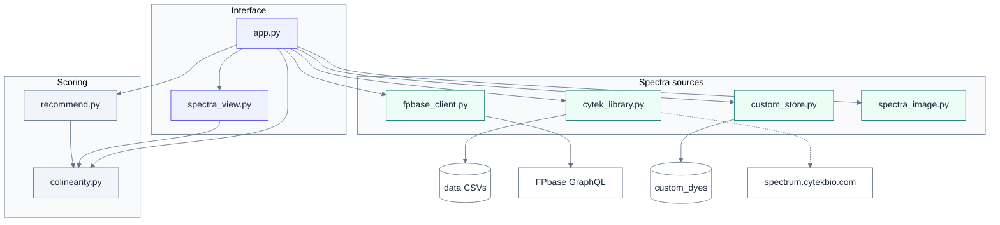
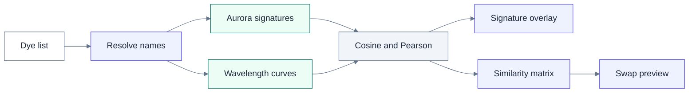

# Fluorophore Colinearity Explorer

Local GUI that reproduces the fluorophore spectral colinearity analysis: pull reference
spectra from [FPbase](https://www.fpbase.org), then compute pairwise spectral similarity
for a fluorophore panel, optionally weighted by a spectral cytometer's actual laser lines
and detector channels (Cytek Aurora/Northern Lights 5L config is built in).

## Run it

Install [uv](https://docs.astral.sh/uv/getting-started/installation/), then:

```bash
git clone https://github.com/soohyuna/flow-colinearity-app.git
cd flow-colinearity-app
uv sync
uv run python run_app.py
```

`uv sync` creates `.venv` from `uv.lock` and installs the locked dependencies.
`uv run` uses that environment. Python 3.13 is required (`requires-python` in
`pyproject.toml`).

Open the URL it prints (http://localhost:8600 by default). Leave the terminal
running. Ctrl+C stops the server.

To check the chart helpers without starting the server:

```bash
uv run python tests/test_spectra_view.py
```

**On a Mac, double-click instead:** `Start Flow Colinearity.command` opens a Terminal
window, starts the server, and opens your browser. `Flow Colinearity.app` does the same
with a Dock icon and no Terminal window; quitting it stops the server. Both live in the
repo folder and work from wherever it was cloned.

On first launch the app downloads Cytek's 5L reference library (two small CSVs, ~100 KB)
from spectrum.cytekbio.com into `data/`, and the FPbase index into `cache/`. Neither is
committed to the repo -- they are the respective owners' data.

Clone it somewhere plain like `~/flow-colinearity-app/`, not under `~/Downloads`,
`~/Desktop` or `~/Documents`: macOS TCC-protects those folders, and some launchers cannot
read files there.

## Architecture

The page in `app.py` is the only place that talks to Streamlit. Scoring stays in
plain functions so a chart can explain a number without changing how the number
is computed.



| Module | Role |
| --- | --- |
| `app.py` | Dye list, **Analyze panel**, pair selection, and the swap section |
| `spectra_view.py` | Aurora signature overlay, similarity matrix, and wavelength charts |
| `colinearity.py` | Emission-only, laser-weighted, and 64-channel Pearson and cosine |
| `recommend.py` | Panel metrics and one-slot replacement scores |
| `cytek_library.py` | Aurora 5L signatures, cached from spectrum.cytekbio.com |
| `fpbase_client.py` | Name matching and wavelength curves from FPbase |
| `custom_store.py` | Saved uploads in `custom_dyes/` |
| `spectra_image.py` | Digitizes a vendor screenshot into a curve or a 64-channel signature |
| `cytek_channels.py` | The 64 detector bands and the laser presets |
| `candidates.py` | Curated replacement reagents |

**Analyze panel** resolves each name, loads the data that source has, then scores
the panel. The default path never calls FPbase.



Wavelength curves are loaded only when you choose **Also load wavelength curves**.
In the default Aurora mode that branch is skipped, and dyes with no signature are
named under the plot.

## How to use

1. Paste one fluorophore per line (flow-cytometry shorthand like `BV421`, `BUV395`,
   `PE-Cy7` is fine). The box starts with an example panel. Choose **Analyze panel**.

   **Aurora signatures** is the default source. It uses Cytek's measured 64-channel
   library, loads locally, and draws those signatures on the UV1–R8 axis. The closest
   pair is drawn in color. Choose a row in the pair list, or a cell in the matrix, to
   put a different pair in front. **Show the rest of the panel** adds the other dyes
   faintly.

   Cosine is the similarity index (how alike the two channel patterns are). Pearson
   stays available as a second column and as a matrix color scale. On Cytek's scale,
   signatures are usually still separable until about 0.98. The counts of pairs above
   0.4 and 0.5 rank the closer pairs in this panel. They are not a do-not-combine line.

2. **Also load wavelength curves** adds FPbase emission and excitation spectra. Open
   **Other instruments** for emission-only, a generic 3-laser or 4-laser line, or custom
   laser wavelengths. The Aurora channel plot remains the view while the score is the
   64-channel signature. **Wavelength names** corrects a wrong FPbase match.

3. A dye the library does not carry is listed as **Not drawn**. Open it to supply a
   CSV or a screenshot. To override a dye that did match, use **Replace a spectrum for
   a dye already in the list**. Either way, choose **Analyze panel** again. An upload
   takes precedence over both FPbase and the Cytek library.

4. **Try a swap** ranks replacement reagents for one slot. Read the warning there before
   acting on a suggestion. The preview draws the current dye, the candidate, and the
   closest partner on the same channel axis. The before/after matrices are under
   **Matrix before and after**.

## Recommendations: what the tool does and does not do

The recommender scores replacement dyes by spectral similarity **only**. That is one
input to panel design, not the objective function. It deliberately:

- restricts to a **curated pool of real, commercially available flow reagents** rather
  than mining all ~974 FPbase dyes -- an unconstrained search happily suggests obscure
  microscopy dyes nobody sells as an antibody conjugate;
- defaults to **same-laser (like-for-like) swaps**, which keeps the marker's brightness
  tier and reagent availability plausible;
- treats the **viability dye** as a special case -- it carries no antibody, so it can move
  anywhere in the spectrum, which usually makes it the cheapest fix in a panel;
- reports the **whole-panel effect** (max pair, count of pairs >0.5 and >0.4), not just
  the one slot, because minimising the single worst pair can raise the number of
  moderately-correlated pairs and leave the panel worse overall. The swap preview flags
  this explicitly as a *mixed result* -- e.g. on the reference panel, Spark Blue 550 ->
  Alexa Fluor 532 lowers the worst pair by 0.070 but adds two pairs above 0.4, because
  AF532 then overlaps PE and PE/Dazzle 594. BB515 is the better swap despite the higher
  headline number.

It cannot know your antibody clones, marker expression levels, or which markers are
co-expressed -- all of which matter more than a correlation coefficient. Two colinear
dyes on mutually exclusive populations are usually fine; two moderately correlated dyes
on co-expressed markers may not be.

## Files

- `pyproject.toml` and `uv.lock` -- dependencies. Install with `uv sync`
- `app.py` -- Streamlit UI
- `spectra_view.py` -- signature overlay, similarity matrix, and wavelength charts
- `tests/test_spectra_view.py` -- checks for the overlay helpers. Run with `uv run python tests/test_spectra_view.py`
- `fpbase_client.py` -- FPbase GraphQL client + fuzzy name matching
- `colinearity.py` -- the three similarity computations (emission-only / laser-weighted / Cytek 64-channel)
- `recommend.py` -- swap scoring and panel-level metrics
- `candidates.py` -- curated replacement reagent pool (viability dyes flagged separately)
- `cytek_channels.py` -- Cytek Aurora 5L's 64 detector channel filter specs (from Cytek's
  own config sheet) and laser presets
- `spectra_image.py` -- digitise a curve out of a spectra-viewer screenshot
- `validate_digitizer.py` -- accuracy check for the above; run it after changing that file
- `custom_store.py` -- persistence for user-supplied dyes
- `custom_dyes/` -- one JSON per saved dye, reloaded on launch
- `spectra_sources.py` -- vendor spectra-viewer deep links for dyes FPbase lacks
- `cytek_library.py` + `data/` -- Cytek's official 5L signatures for 341 fluorochromes
- `run_app.py` -- launcher that survives being started from an unreadable working directory
- `cache/` -- cached FPbase dye index and candidate spectra so repeat runs don't refetch
  (974 dyes as of first fetch; use "Force-refresh FPbase dye index" in the UI if FPbase
  adds new dyes)

## Cytek's official Aurora 5L reference library

The Full Spectrum Viewer at spectrum.cytekbio.com loads two plain CSVs as part of its
normal page render -- no API, no login, just static files. They are cached in `data/`:

* `cytek_5L_signatures.csv` -- **341 fluorochromes x 64 detector channels** for the
  5L 16UV-16V-14B-10YG-8R configuration, as percent of each dye's peak channel;
* `cytek_fluorochrome_lasers.csv` -- which laser line(s) excite each dye.

This is the vendor's own *measured* reference signature, so it beats both a computed
emission x excitation model and a digitised plot: no interpolation, and it already
contains tandem donor bleed-through, filter transmission and detector response.

**Aurora signatures** is the default spectral source and the right choice for analysis
on that instrument: nothing is inferred, and no FPbase lookup happens at all, so matching
is instant. In that mode the score is the 64-channel signature, since the other modes
need wavelength curves that signatures do not carry. Any dye outside the library must
have a signature supplied, or it is named under the plot and left out.

**Also load wavelength curves** brings the wavelength modes back, under **Other
instruments**. The Cytek signature layers on top of FPbase rather than replacing it.
The Aurora score uses `SIGNATURE`. The wavelength modes keep using the FPbase `EM`/`EX`
curves, so a dye can be covered in every mode at once. Dyes with no FPbase entry end up
signature-only and are named on the wavelength chart.

Measured against this library, the two digitisers came out well -- BUV 615 read by eye
scored cosine 0.9988 vs official, APC/Fire 810 machine-extracted 0.9820, both with the
correct peak channel. The digitisers remain the fallback for anything outside the 341.

A few values in the file are slightly negative (background-subtracted signatures scatter
about zero in empty channels); they are clipped to zero on load, as the viewer does.

Provenance: this is Cytek's data, cached for local panel design. Don't redistribute it.

## When a fluorophore isn't found

The app searches FPbase, which covers **1,483 fluorophores** — 974 organic dyes plus 509
fluorescent proteins. The protein half matters for flow: EGFP, tdTomato, mScarlet,
mNeonGreen, ZsGreen, DsRed and friends live there, and the two sets are completely
disjoint on FPbase, so a dyes-only search misses every reporter.

For anything still missing, the "not found" panel lists direct links into the vendor
spectra viewers for that dye name, best-first for spectral flow:

| source | gives |
|---|---|
| BioLegend Spectra Analyzer | Cytek channel signature + spectrum |
| Cytek Full Spectrum Viewer | channel signature |
| BD Spectrum Viewer | signature + spectrum (BUV / BV / BB) |
| Thermo SpectraViewer | spectrum (Alexa, eFluor, Super Bright) |
| AAT Bioquest | spectrum (broad third-party) |
| FPbase site search | numeric — if you find it here, give me the exact name and it imports without a screenshot |

Screenshot the plot there and load it with the digitisers. Prefer a **channel signature**
plot over a wavelength spectrum.

The source picker defaults to *Screenshot: Cytek channel signature*, and each uploader is
restricted to the file types it can actually read. Dropping a PNG into the CSV slot used
to fail with `'utf-8' codec can't decode byte 0x89` — the PNG magic byte — which read as
"the app won't take my screenshot". The CSV slot now rejects images by name and says
which option to use instead.

### Why links and not automatic download

Every vendor viewer is a client-rendered app that pulls its curves from an undocumented
private endpoint after user interaction — nothing usable is in the served HTML (verified
for Cytek and AAT Bioquest). Those endpoints can be reverse-engineered, but they are
unversioned, break without warning, and automated access generally falls outside the
sites' terms of use. Reading a published figure you opened yourself does not. FPbase is
the exception and is queried directly: documented GraphQL API, openly licensed data.

## Saved custom dyes

Anything you supply by hand — a CSV, a digitised wavelength spectrum, or a digitised
Cytek signature — is written to `custom_dyes/` (one JSON per dye, with provenance) and
reloaded automatically on the next launch. Name the dye in your list and it is used
without re-uploading. **Advanced** lists what is stored, with a delete control.

Pre-seeded, both digitised from vendor signature plots:

| dye | source | peak | note |
|---|---|---|---|
| APC/Fire 810 | BioLegend signature plot, machine-extracted | R8 | |
| BUV 615 | Cytek Spectra Viewer plot, **read by eye** | UV10 | values ±4%; re-extract from the PNG for exact numbers |

Delete a file to drop that dye, or overwrite it by supplying the dye again.

## Digitising from an image

Two kinds of vendor plot can be read in. **Check the x axis before choosing:**

### Cytek channel signature (preferred whenever it exists)

x axis reads **Emission Channel** — UV1…UV16, V1…V16, B1…B14, YG1…YG10, R1…R8. This is
the Aurora's *own measured* 64-channel signature, which is exactly the vector the Cytek
mode computes internally, so it is read straight in with no wavelength interpolation and
no excitation weighting.

It is also **more accurate than anything derived from reference spectra**: it already
contains tandem donor bleed-through, filter transmission and detector response. For a
tandem like APC/Fire 810 that matters — its signature shows real signal in the 812/34
detector of *every* laser (UV16 0.10, V16 0.22, B14 0.05, YG10 0.29) alongside the R8
peak, which is the kind of cross-laser structure that a naive emission×excitation model
approximates poorly.

The trade-off: a signature is specific to the 5L Aurora, so a dye supplied this way works
**only** in the Cytek 5L 64-channel mode and is dropped (with a warning) from the
emission-only and generic-laser modes.

Calibration needed: the plot-box corners plus two y-axis reference points (e.g. the
pixel row of the 0.0 gridline and of the 1.0 gridline). Channel x positions are derived
automatically, since 64 evenly spaced categories are known a priori — which makes this
markedly more robust than tracing a continuous curve.

### Wavelength spectrum

x axis in nanometres — the classic excitation/emission plot. Use this when no signature
plot is published. Open the dye under **Not drawn**, then choose
**Screenshot: wavelength spectrum**.

You supply: the plot-box pixel corners (an annotated pixel ruler is drawn over your
image), the wavelength at each x edge, the value at each y edge, and the curve colour
(the strongest non-grey colours found inside the box are offered as swatches). Extract
the emission and excitation curves one at a time.

**What makes a good screenshot:** only this dye plotted; axes visible; as large as
possible; the legend not overlapping the curve.

**The one failure mode to know about:** a legend's colour swatch is drawn in the *same*
colour as the curve and sits above it, so it gets read as the curve and pins that span
to a flat wrong value — worth up to 0.33 of full scale in testing. The app detects this
automatically (a flat stretch away from zero, either long or forming a local-maximum
plateau) and tells you to tick **Exclude a region** and box the swatch. Box it *tightly*:
a loose box also deletes real curve data, which in testing was worse than the original
problem.

**Accuracy**, measured by `validate_digitizer.py` — it renders a known FPbase spectrum as
a vendor-style plot, digitises it back, and compares:

| curve | mean abs error | max | RMSE | peak |
|---|---|---|---|---|
| emission (solid + shaded) | 0.0060 | 0.060 | 0.0092 | exact |
| excitation (dashed) | 0.0055 | 0.026 | 0.0069 | 2 nm off |

Effect on the numbers the app reports: max change 0.013 in that dye's similarity to any
panel member, mean 0.002, same peak detector channel. That is well inside the margin
that matters for panel decisions — but it is still a redrawing of a picture, not vendor
data, so treat a digitised dye as triage rather than evidence.

## Name matching

Short queries are the tricky case. The matcher is token- and parenthetical-aware so that
`PE` resolves to `PE (R-PE / R-phycoerythrin)` rather than to `PE-Cy5` or
`Alexa Fluor 647-R-phycoerythrin (R-PE)`, and `APC` to `APC (allophycocyanin)` rather
than `APC/H7`. **Always check the names under Wavelength names** when that source is
on. A silently wrong match produces plausible-looking but meaningless curves. The
Aurora signature match is stricter and is what the default plot uses.

## Known limitations

- Dyes with no FPbase entry have no wavelength curve. `APC/Fire 810` and `BUV 615`
  are in the Aurora library, so the default signature view still draws them. A wavelength
  view needs a CSV or a digitised screenshot. There is no scriptable public API for
  Cytek's own spectra viewer.
- Excitation efficiency uses absorption spectra as a fallback when FPbase has no
  dedicated excitation curve for a dye (noted in the fetch step).
- A dye with an emission curve but no excitation curve is dropped from the laser-weighted
  and Cytek 64-channel modes, since there is no way to weight it by laser.
